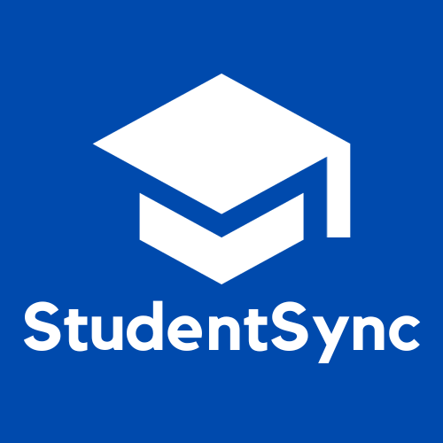

# StudentSync - Java based OOP project

## Overview

StudentSync is a Java-based School Management System that brings teachers and students together to effortlessly manage and track their scholarly activities. Whether you're a teacher or a student, StudentSync offers a user-friendly interface for seamless interaction.

## How It Works

### User Authentication

- **Log In**: Existing users can access the system with their username and password.
  

- **Sign In**: New users can register by providing necessary details, specifying if they are a teacher or a student. The program ensures all required fields are filled; otherwise, it prompts for completion.
  

### Teacher Features

- **Create Classroom**: If you're a teacher without any classes, the app guides you to create a new classroom. Fill in details like "Class name," "Class password," "start date," and "end date."

  

- **Manage Classes**: Teachers can enter each created class, adding attendances (limited to dates between start and end) and grades (numeric only, with error notification for invalid entries). A messaging feature allows teachers to communicate with the entire class.

  

### Student Features

- **Join Classes**: Students can join classes by entering the class name and password.

  

- **Dashboard**: A personalized dashboard displays all enrolled classes, showing attendances, grades, and class messages from the teacher.

  

## How to Use

1. **Log In/Sign In**: Choose to log in with existing credentials or sign in as a new user.
2. **Teacher's Journey**:
   - Create a class if you don't have one.
   - Manage classes by adding attendances, entering grades, and sending messages.
3. **Student Adventure**:
   - Join classes using the provided class name and password.
   - Check your dashboard for attendances, grades, and teacher messages.

## Contributors

- Damian Dorian
